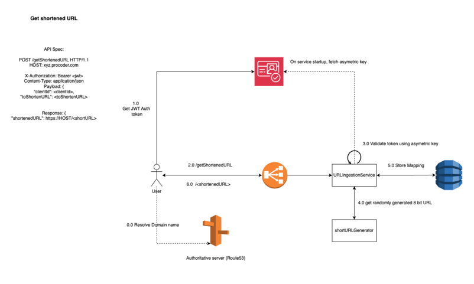
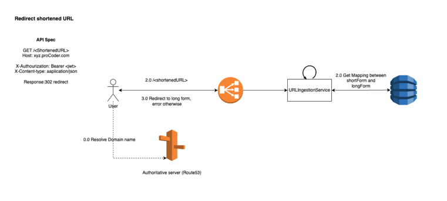

### URL Shortener service

This service exposes two APIs:

#### A. Generate shortened URL

```
POST /getShortenedURL HTTP/1.1
HOST: xyz.procoder.com

X-Authorization: Bearer <jwt>
Content-Type: application/json
Payload: {
    "clientId": <clientId>,
    "toShortenURL": <toShortenURL>
}

Response: {
    "shortenedURL": https://HOST/<shortURL>
}
```

**Flow:**


#### B: Redirect short URL to it's long form.
```
GET /<ShortenedURL>
Host: xyz.proCoder.com

X-Authourization: Bearer <jwt>
X-Content-type: aaplication/json

Response: 302 redirect, 400 if URL not found,
 5XX otherwise
```

**Flow:**




**Note**: These APIs are expected to be used by a mobile application or web application where the user
has a fixed quota on the number of short URLs that they can generate and hence we use OIDC and OAuth for authN and authZ instead of API keys.